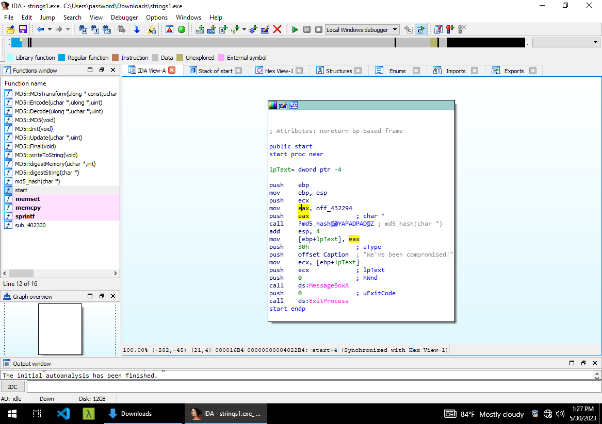
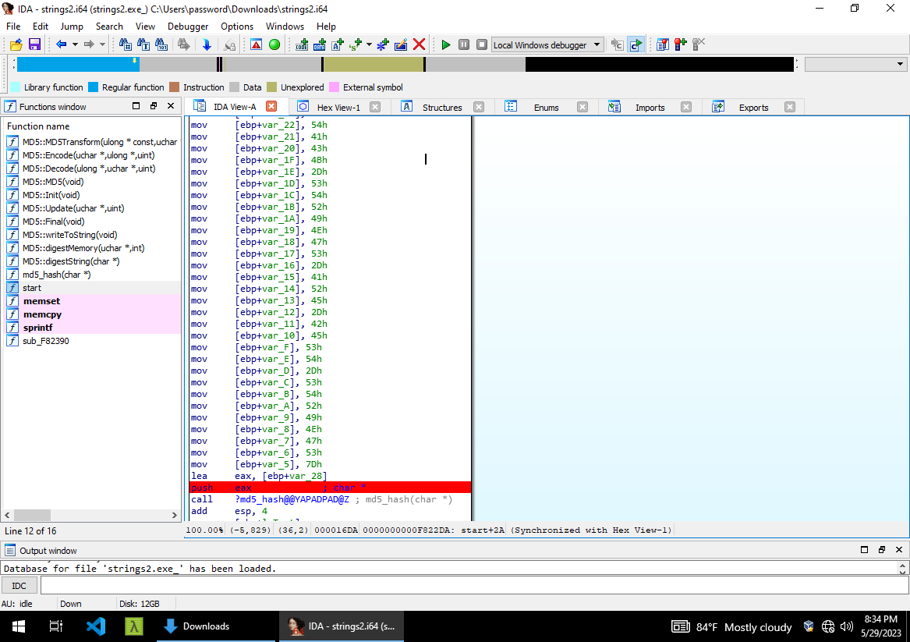

# Basic Malware RE
This is how I managed to solve [Basic Malware RE](https://tryhackme.com/room/basicmalwarere) challange.

I used mainly two tools, IDA and strings. Worked in Flare sandbox.

## Challenge 1

1. First, I tried `strings` on the sample file, tons of flags came out. I'm sure trying them one after another is not the most effeciant way, probably we need to take a look into the code to find out which flag among those owns the hash.
1. Its time for IDA then, opened the sample file, head to the entry point which is `start` function.

1. You can easily spot where `md5_hash` subroutine is called, normally, the subroutine is applied after instruction `push eax`.
1. Now eax has its value assigned one line earlier `mov eax, off_432294` which is holding the flag we want.

## Challenge 2

1. Now when I run `strings` on the second sample, nothing interesting came up, not a single flag.
1. Just like first challange, we gonna take a look on the code.

1. Many variables and pointers, I'm too lazy to track this manually. So I decided to add a break point after all these `mov` lines, on `push eax` just before calling `md5_hash`
1. Run "click play button" then the code stops on the break point, double cliking `eax` you will find out your flag.
Now you can notice how a <em>stack</em> looks for real.

## Challenge 3
